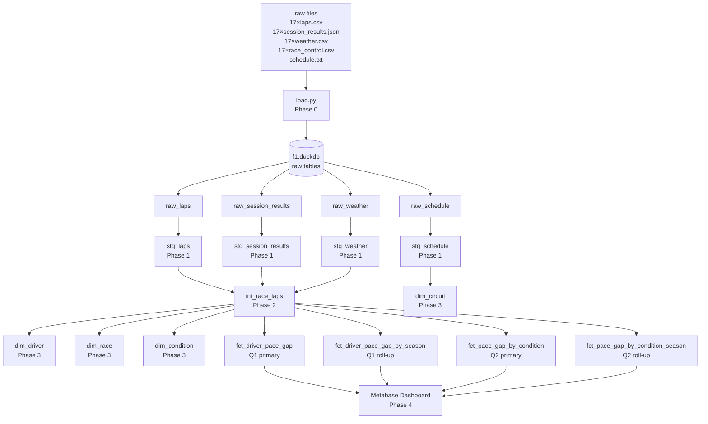

# F1 Dataset — Deep Analysis & Pipeline Plan
> Based on real inspection of all 68 raw files (17 races × 4 file types + schedule.txt)

---

## 1. Dataset Overview

| | |
|---|---|
| **Races** | 17 total |
| **Circuits** | Baku (Azerbaijan) · Monza (Italy) · Zandvoort (Netherlands) |
| **Seasons** | 2018 – 2024 |
| **Drivers per race** | Always exactly 20 |
| **Total session result rows** | 340 (20 drivers × 17 races) |
| **Total lap rows (all files)** | 17,769 |
| **Total weather samples** | 2,509 |

### Races per circuit

| Circuit | Seasons available |
|---|---|
| Azerbaijan GP (Baku) | 2018, 2019, 2021, 2022, 2023, 2024 |
| Italian GP (Monza) | 2018, 2019, 2020, 2021, 2022, 2023, 2024 |
| Dutch GP (Zandvoort) | 2021, 2022, 2023, 2024 |

> ⚠️ **No Zandvoort before 2021** — it was not on the calendar. Factor this into Q2 analysis.

---

## 2. Raw Data Structure

### File naming → contextual fields

```
20230827_Dutch Grand Prix_Race_laps.csv
   │          │                   │
   ▼          ▼                   ▼
race_date   circuit           file_type
2023-08-27  Dutch Grand Prix    laps
season: 2023
```

### 2.1 `_laps.csv` — 31 columns

| Column | Type (raw) | Notes |
|---|---|---|
| *(unnamed index)* | int | Drop — meaningless row index |
| `Time` | timedelta string | Session time of lap completion |
| `Driver` | string | 3-letter abbreviation (HAM, VER…) |
| `DriverNumber` | float | ⚠️ arrives as float (e.g. `10.0`) |
| `LapTime` | timedelta string | `"0 days 00:01:28.179000"` — needs conversion |
| `LapNumber` | float | ⚠️ float, needs int cast |
| `Position` | float | ⚠️ float (e.g. `1.0`, `''` for some laps) |
| `Compound` | string | SOFT, MEDIUM, HARD, WET, INTERMEDIATE, nan |
| `TyreLife` | float | Laps on current tyre |
| `FreshTyre` | string `"True"`/`"False"` | Needs boolean cast |
| `Team` | string | ⚠️ Team names inconsistent across years (see §4) |
| `IsPersonalBest` | string | `"True"`/`"False"` |
| `IsAccurate` | string | `"True"`/`"False"` — **critical filter** |
| `Deleted` | string | `"True"`/`"False"` — lap deleted by stewards |
| `TrackStatus` | string | Encoded flags (see §5) |
| Many sector/speed cols | float | Not needed for our questions |

**Key quality numbers:**

| Issue | Count | % of total |
|---|---|---|
| `LapTime` null or `"nan"` | 478 | 2.7% |
| `IsAccurate = False` | 2,532 | 14.2% |
| `Deleted = True` | 95 | 0.5% |
| **Usable laps** | **~15,237** | **~85.7%** |

### 2.2 `_session_results.json` — JSON array

| Column | Type (raw) | Notes |
|---|---|---|
| `DriverNumber` | string | ✅ Already a string |
| `Abbreviation` | string | 3-letter code |
| `FullName` | string | e.g. "Lewis Hamilton" |
| `FirstName` / `LastName` | string | |
| `TeamName` | string | ⚠️ Inconsistent across years |
| `TeamId` | string | snake_case e.g. `"mercedes"` — more stable |
| `Position` | float | Final position (1.0–20.0) |
| `ClassifiedPosition` | string | `"1"`–`"20"` or `"R"` (retired) |
| `GridPosition` | float | Starting position |
| `Status` | string | **See full breakdown below** |
| `Points` | float | Points scored |
| `Time` | string | ISO duration e.g. `"P0DT1H43M44.291S"` — drop or keep as-is |

**`Status` complete breakdown (all 340 rows):**

| Status | Count | Meaning | Keep for Q1? |
|---|---|---|---|
| `Finished` | 211 | Completed full race distance | ✅ YES |
| `+1 Lap` | 61 | Completed but lapped | ❌ No |
| `+2 Laps` | 10 | Completed but 2 laps down | ❌ No |
| `Accident` | 8 | DNF — accident | ❌ No |
| `Collision` | 8 | DNF — collision | ❌ No |
| `Engine` | 7 | DNF — engine failure | ❌ No |
| `Power Unit` | 6 | DNF — PU failure | ❌ No |
| `Brakes` | 4 | DNF — brake failure | ❌ No |
| `Hydraulics` | 4 | DNF — hydraulics | ❌ No |
| `Retired` | 4 | DNF — generic retired | ❌ No |
| `Gearbox` | 2 | DNF | ❌ No |
| `Overheating` | 2 | DNF | ❌ No |
| `Disqualified` | 1 | DSQ | ❌ No |
| `Puncture` | 1 | DNF | ❌ No |
| `Transmission` | 1 | DNF | ❌ No |

> **Decision:** filter `Status = 'Finished'` in the **Intermediate model**, not staging. Staging keeps all 340 rows.

### 2.3 `_weather.csv`

| Column | Type (raw) | Notes |
|---|---|---|
| `Time` | timedelta string | Offset from session start |
| `AirTemp` | float | Range: **14.6°C – 34.1°C** |
| `Humidity` | float | |
| `Pressure` | float | |
| `Rainfall` | string `"True"`/`"False"` | ⚠️ Needs boolean cast |
| `TrackTemp` | float | Range: **18.9°C – 54.6°C** |
| `WindDirection` | int | Degrees |
| `WindSpeed` | float | |

**Wet races (Rainfall = True recorded):**

| Race | Avg AirTemp | Avg TrackTemp | Status |
|---|---|---|---|
| 2018 Italian GP (Monza) | 22.2°C | 30.8°C | 🌧️ WET |
| 2023 Dutch GP (Zandvoort) | 16.8°C | 24.9°C | 🌧️ WET |

> ⚠️ **Only 2 wet races out of 17.** This is a real constraint for Q2. The wet/dry dimension will have limited wet data. Mention this in `report.md` as a prototype limitation.

### 2.4 `schedule.txt` — space-separated

| Column | Notes |
|---|---|
| `Year` | Season |
| `RoundNumber` | Position in calendar |
| `Country` | e.g. `Azerbaijan` |
| `Location` | e.g. `Baku` |
| `OfficialEventName` | Full official name (quoted) |
| `EventDate` | Date string |
| `EventName` | e.g. `"Azerbaijan Grand Prix"` |
| `TotalLaps` | Total laps in the race |

---

## 3. Team Name Problem ⚠️

The same constructor appears under different names across seasons. This is a **real data quality issue** you must document in staging.

| Stable `TeamId` | Names found in data |
|---|---|
| `sauber` | `Sauber` (2018) → `Alfa Romeo Racing` (2019–20) → `Alfa Romeo` (2021–23) → `Kick Sauber` (2024) |
| `alphatauri` | `Toro Rosso` (2018–19) → `AlphaTauri` (2020–23) → `RB` (2024) |
| `force_india` | `Force India` (2018) → `Racing Point` (2019–20) → `Aston Martin` (2021+) |
| `renault` | `Renault` (2018–20) → `Alpine` (2021+) |

> **Solution:** use `TeamId` from `session_results.json` as the stable identifier in `dim_team`. `TeamName` becomes a display label only.

---

## 4. TrackStatus Encoding ⚠️

`TrackStatus` in laps is a **concatenated numeric code**, not a single value.

| Code | Meaning |
|---|---|
| `1` | All clear (normal racing) — 15,568 laps |
| `2` | Yellow flag |
| `4` | Safety Car (SC) |
| `6` | SC ending |
| `7` | Virtual Safety Car (VSC) |

Multi-digit values like `12`, `41`, `124` = multiple flags active simultaneously.

> **For our analysis:** we don't need TrackStatus for Q1 or Q2 directly. But it explains why some laps have unusual times. The `IsAccurate = False` filter handles this automatically.

---

## 5. Temperature Category Decision

Based on real track temperature range (18.9°C – 54.6°C):

```
TrackTemp < 30°C    → 'cool'     (Baku 2018, Zandvoort wet races)
TrackTemp 30–44°C   → 'warm'     (majority of races)
TrackTemp ≥ 45°C    → 'hot'      (Baku 2022: 47.1°C, Italy 2024: 49.3°C)
```

**Distribution across 17 races:**

| Category | Races | Examples |
|---|---|---|
| cool (< 30°C) | 3 | Baku 2018 (25.3°C), Zandvoort 2023 (24.9°C), Zandvoort 2023 wet |
| warm (30–44°C) | 11 | Most Italian and Baku races |
| hot (≥ 45°C) | 3 | Baku 2022 (47.1°C), Italy 2022 (43.1°C), Italy 2024 (49.3°C) |

---

## 6. Full Pipeline Plan



---

## 7. Staging Cleaning Plan (Phase 1)

### stg_laps — cleaning actions

| Column | Problem | Fix |
|---|---|---|
| *(unnamed index col)* | Meaningless row index | `DROP` |
| `LapTime` | Timedelta string `"0 days 00:01:28.179000"` | Parse to **seconds** (float) using string split |
| `LapTime` nulls | 478 rows have null or `"nan"` | `WHERE LapTime IS NOT NULL AND LapTime != 'nan'` |
| `IsAccurate = False` | 2,532 laps flagged as unreliable | `WHERE IsAccurate = 'True'` |
| `DriverNumber` | Arrives as float `10.0` | Cast to `VARCHAR` |
| `LapNumber` | Arrives as float `1.0` | Cast to `INTEGER` |
| `Position` | Arrives as float, some empty | Cast to `INTEGER`, allow NULL |
| `FreshTyre` | String `"True"`/`"False"` | Cast to `BOOLEAN` |
| `IsPersonalBest` | String `"True"`/`"False"` | Cast to `BOOLEAN` |
| `Team` | Inconsistent across years | Keep as-is in staging, handle in dim_team |
| Sector/speed columns | Not needed for our questions | `DROP` (optional — keeps model lean) |

### stg_session_results — cleaning actions

| Column | Problem | Fix |
|---|---|---|
| `Position` | Float `1.0` | Cast to `INTEGER` |
| `GridPosition` | Float | Cast to `INTEGER` |
| `Points` | Float | Cast to `FLOAT` (keep as-is) |
| `TeamName` | Inconsistent across years | Keep as-is — `TeamId` is the stable key |
| `Time` | ISO duration string | Keep as-is (not needed for analysis) |
| `Q1`/`Q2`/`Q3` | All NULL in race results | `DROP` |
| `HeadshotUrl` | Empty string | `DROP` |
| `CountryCode` | Empty string | `DROP` |
| `BroadcastName` | Redundant (have FullName) | `DROP` |

### stg_weather — cleaning actions

| Column | Problem | Fix |
|---|---|---|
| `Rainfall` | String `"True"`/`"False"` | Cast to `BOOLEAN` |
| `AirTemp` | Float ✅ | No change |
| `TrackTemp` | Float ✅ | No change |
| `Time` | Timedelta string | Keep as session_time_offset |

### stg_schedule — cleaning actions

| Column | Problem | Fix |
|---|---|---|
| All session date columns | Not needed | `DROP` (keep only Year, Location, EventName, TotalLaps, EventDate) |
| `EventDate` | String `"2018-04-29 00:00:00"` | Cast to `DATE` |
| `Year` | Int ✅ | Rename to `season` |

---

## 8. Intermediate Model Plan (Phase 2)

### What one row represents
> **One lap driven by one driver in one race** (after filtering to `IsAccurate = True` and `LapTime IS NOT NULL`)

### Join keys

```
stg_laps  ──────────────────────────┐
  race_date + driver_number          │── int_race_laps
stg_session_results ─────────────────┘
  race_date + driver_number

stg_weather ─── aggregate per race_date → avg_track_temp, is_wet_race
  race_date       then join on race_date
```

### Fields added in Intermediate

| Field | Derived from | How | Why |
|---|---|---|---|
| `is_finished` | `race_status` | `race_status = 'Finished'` | Q1 filter criterion |
| `is_wet_race` | weather `Rainfall` | `'wet'` if any sample True, else `'dry'` | Q2 dimension |
| `track_temp_category` | weather `TrackTemp` | `<30='cool'`, `30-44='warm'`, `≥45='hot'` | Q2 dimension |
| `avg_track_temp_c` | weather `TrackTemp` | AVG per race | Context for conditions |

### DBML — Intermediate Model

```dbml
Table int_race_laps {
  race_date        date        [note: "from filename"]
  circuit          varchar     [note: "from filename"]
  season           int         [note: "from filename"]
  driver_number    varchar
  driver_abbreviation varchar
  driver_full_name varchar
  team_name        varchar
  team_id          varchar     [note: "stable key across rebrands"]
  lap_number       int
  lap_time_seconds float       [note: "converted from timedelta string"]
  tyre_compound    varchar
  tyre_life        int
  finish_position  int         [note: "NULL for non-finishers"]
  classified_position varchar  [note: "'1'-'20' or 'R'"]
  race_status      varchar     [note: "Finished, +1 Lap, Engine, etc."]
  is_finished      boolean     [note: "true only for Status=Finished"]
  is_wet_race      varchar     [note: "'wet' or 'dry'"]
  avg_track_temp_c float
  track_temp_category varchar  [note: "cool / warm / hot"]
}
```

---

## 9. Star Model Plan (Phase 3)

### Analytical Questions

**Q1 (predefined):**
> What is the difference between the average lap time of each driver and the average lap time of the race winner in the same race?

**Q2 (your own):**
> How does the average lap time gap between each driver and the race winner vary across different race conditions (wet vs dry and track temperature)?

### Four fact tables — grain sentences

| Fact table | Grain sentence |
|---|---|
| `fct_driver_pace_gap` | Each row = **one driver** in **one race** |
| `fct_driver_pace_gap_by_season` | Each row = **one driver** at **one circuit** in **one season** |
| `fct_pace_gap_by_condition` | Each row = **one driver** in **one race** grouped by **condition** |
| `fct_pace_gap_by_condition_season` | Each row = **one driver** in **one condition group** in **one season** |

### DBML — Full Star Schema

```dbml
// ─── DIMENSIONS ────────────────────────────────────────

Table dim_driver {
  driver_key          int [pk]
  driver_number       varchar
  driver_abbreviation varchar
  driver_full_name    varchar
  team_name           varchar   [note: "display name — latest known"]
  team_id             varchar   [note: "stable key e.g. 'mercedes'"]
}

Table dim_team {
  team_key   int [pk]
  team_id    varchar   [note: "stable e.g. 'sauber'"]
  team_name  varchar   [note: "display name for filters"]
}

Table dim_circuit {
  circuit_key int [pk]
  circuit     varchar
  country     varchar
  location    varchar
}

Table dim_race {
  race_key             int [pk]
  race_date            date
  circuit              varchar
  season               int
  is_wet_race          varchar
  track_temp_category  varchar
}

Table dim_condition {
  condition_key        int [pk]
  is_wet_race          varchar
  track_temp_category  varchar
  condition_label      varchar   [note: "e.g. 'wet / cool'"]
}

// ─── FACT TABLES ───────────────────────────────────────

Table fct_driver_pace_gap {
  race_key                 int [ref: > dim_race.race_key]
  driver_key               int [ref: > dim_driver.driver_key]
  avg_lap_time_s           float  [note: "driver avg, finished laps only"]
  winner_avg_lap_time_s    float  [note: "race winner avg"]
  lap_time_gap_s           float  [note: "driver − winner, 0 for winner"]
  lap_count                int    [note: "laps counted for this driver"]
}

Table fct_driver_pace_gap_by_season {
  driver_key          int [ref: > dim_driver.driver_key]
  circuit_key         int [ref: > dim_circuit.circuit_key]
  season              int
  avg_lap_time_gap_s  float
  min_gap_s           float
  max_gap_s           float
  race_count          int
}

Table fct_pace_gap_by_condition {
  race_key              int [ref: > dim_race.race_key]
  driver_key            int [ref: > dim_driver.driver_key]
  condition_key         int [ref: > dim_condition.condition_key]
  avg_lap_time_s        float
  winner_avg_lap_time_s float
  lap_time_gap_s        float
  lap_count             int
}

Table fct_pace_gap_by_condition_season {
  driver_key          int [ref: > dim_driver.driver_key]
  condition_key       int [ref: > dim_condition.condition_key]
  season              int
  avg_lap_time_gap_s  float
  race_count          int
}
```

---

## 10. Known Limitations to Document in report.md

| Limitation | Impact | How to address |
|---|---|---|
| Only 2 wet races (Monza 2018, Zandvoort 2023) | Q2 wet/dry split is statistically weak | Mention as prototype constraint. The architecture is correct even if wet data is limited. |
| No Zandvoort data before 2021 | Seasonal comparisons at Zandvoort cover only 4 years | State explicitly in dashboard notes |
| Team rebranding | `TeamName` is inconsistent across years | Use `TeamId` as stable key in `dim_team`. Note this in staging |
| `IsAccurate = False` removes 14% of laps | Could affect drivers with many SC/VSC laps | Justified — inaccurate laps distort pace comparison |
| `Position` in laps is float with empty values | Cannot rely on lap-level position for winner detection | Use `finish_position = 1` from `session_results` instead |

---

## 11. Files to Create (Summary)

```
exam-case/
├── load/load.py
├── models/
│   ├── staging/
│   │   ├── sources.yml
│   │   ├── schema.yml
│   │   ├── stg_laps.sql
│   │   ├── stg_session_results.sql
│   │   ├── stg_weather.sql
│   │   └── stg_schedule.sql
│   ├── intermediate/
│   │   └── int_race_laps.sql
│   └── mart/
│       ├── dim_driver.sql
│       ├── dim_team.sql
│       ├── dim_circuit.sql
│       ├── dim_race.sql
│       ├── dim_condition.sql
│       ├── fct_driver_pace_gap.sql
│       ├── fct_driver_pace_gap_by_season.sql
│       ├── fct_pace_gap_by_condition.sql
│       └── fct_pace_gap_by_condition_season.sql
├── design.dbml
└── report.md
```
