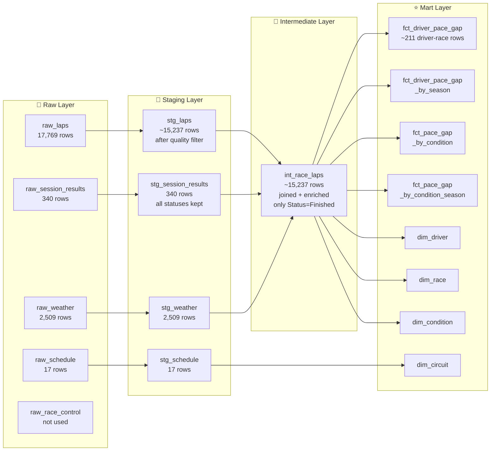

# Raw Data — Structure Diagram

> All 5 raw sources. Columns marked ⚠️ have quality issues. Columns marked 🗑️ will be dropped in staging.

---

## Relationships between raw sources

```mermaid
erDiagram
    RAW_LAPS {
        string      race_date       "derived from filename"
        string      circuit         "derived from filename"
        int         season          "derived from filename"
        string      Driver          "3-letter abbrev e.g. HAM"
        float       DriverNumber    "⚠️ float, e.g. 10.0"
        string      LapTime         "⚠️ timedelta string"
        float       LapNumber       "⚠️ float"
        float       Position        "⚠️ float, some empty"
        string      Team            "⚠️ inconsistent across years"
        string      Compound        "SOFT/MEDIUM/HARD/WET/INTER"
        float       TyreLife
        string      FreshTyre       "⚠️ string True/False"
        string      IsAccurate      "⚠️ string True/False"
        string      IsPersonalBest  "⚠️ string True/False"
        string      Deleted         "⚠️ string True/False"
        string      TrackStatus     "encoded flags e.g. 1,12,4"
        string      DeletedReason
        float       SpeedI1         "🗑️ not needed"
        float       SpeedI2         "🗑️ not needed"
        float       SpeedFL         "🗑️ not needed"
        float       SpeedST         "🗑️ not needed"
        string      Sector1Time     "🗑️ not needed"
        string      Sector2Time     "🗑️ not needed"
        string      Sector3Time     "🗑️ not needed"
        string      Time            "🗑️ session offset"
        string      source_file
    }

    RAW_SESSION_RESULTS {
        string      race_date       "derived from filename"
        string      circuit         "derived from filename"
        int         season          "derived from filename"
        string      DriverNumber    "✅ already string"
        string      Abbreviation    "3-letter abbrev"
        string      FullName
        string      FirstName
        string      LastName
        string      TeamName        "⚠️ inconsistent across years"
        string      TeamId          "✅ stable e.g. mercedes"
        float       Position        "final position 1.0-20.0"
        string      ClassifiedPosition "1-20 or R"
        float       GridPosition
        string      Status          "Finished / +1 Lap / Engine…"
        float       Points
        string      BroadcastName   "🗑️ redundant"
        string      HeadshotUrl     "🗑️ empty"
        string      CountryCode     "🗑️ empty"
        string      Q1              "🗑️ always null in race"
        string      Q2              "🗑️ always null in race"
        string      Q3              "🗑️ always null in race"
        string      TeamColor       "🗑️ hex color"
        string      DriverId
        string      Time            "ISO duration string"
        string      source_file
    }

    RAW_WEATHER {
        string      race_date       "derived from filename"
        string      circuit         "derived from filename"
        int         season          "derived from filename"
        string      Time            "session time offset"
        float       AirTemp         "range: 14.6 – 34.1 °C"
        float       Humidity
        float       Pressure
        string      Rainfall        "⚠️ string True/False"
        float       TrackTemp       "range: 18.9 – 54.6 °C"
        int         WindDirection
        float       WindSpeed
        string      source_file
    }

    RAW_RACE_CONTROL {
        string      race_date       "derived from filename"
        string      circuit         "derived from filename"
        int         season          "derived from filename"
        string      Time
        string      Category        "e.g. Flag, Drs, SafetyCar"
        string      Message
        string      Status
        string      Flag            "GREEN/YELLOW/RED/SC/VSC"
        string      Scope
        string      Sector
        string      RacingNumber
        float       Lap
        string      source_file
    }

    RAW_SCHEDULE {
        int         Year
        int         RoundNumber
        string      Country
        string      Location        "e.g. Baku"
        string      OfficialEventName
        string      EventDate
        string      EventName       "e.g. Azerbaijan Grand Prix"
        string      EventFormat
        int         TotalLaps
        string      Session1
        string      Session1Date    "🗑️ practice/quali dates"
        string      Session2
        string      Session2Date    "🗑️"
        string      Session3
        string      Session3Date    "🗑️"
        string      Session4
        string      Session4Date    "🗑️"
        string      Session5
        string      Session5Date    "🗑️"
    }

    RAW_LAPS            }o--||  RAW_SESSION_RESULTS : "race_date + DriverNumber"
    RAW_LAPS            }o--||  RAW_WEATHER         : "race_date (aggregated)"
    RAW_SESSION_RESULTS }o--||  RAW_SCHEDULE        : "circuit + season = EventName + Year"
```

---

## Quality issues summary

| Source | Issue | Count | Fix in |
|---|---|---|---|
| `raw_laps` | `LapTime` null or `"nan"` | 478 rows (2.7%) | staging — exclude |
| `raw_laps` | `IsAccurate = False` | 2,532 rows (14.2%) | staging — exclude |
| `raw_laps` | `DriverNumber` as float | all rows | staging — cast to VARCHAR |
| `raw_laps` | `LapNumber`, `Position` as float | all rows | staging — cast to INTEGER |
| `raw_laps` | `FreshTyre`, `IsAccurate`, `IsPersonalBest`, `Deleted` as string | all rows | staging — cast to BOOLEAN |
| `raw_laps` | `LapTime` as timedelta string | all rows | staging — convert to seconds |
| `raw_laps` | `Team` inconsistent across years | 18 name variants | staging — keep, solve in dim_team |
| `raw_session_results` | `TeamName` inconsistent | same 18 variants | staging — keep, use `TeamId` |
| `raw_session_results` | `Status` has 15 different values | 340 rows | intermediate — filter `Finished` |
| `raw_weather` | `Rainfall` as string | all rows | staging — cast to BOOLEAN |
| `raw_schedule` | Session date columns not needed | 10 columns | staging — drop |

---

## What flows into each phase

